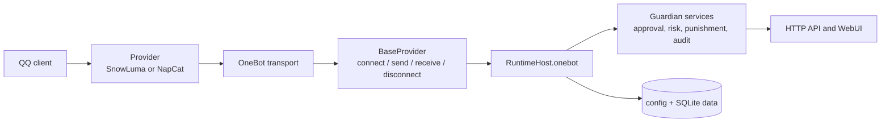

# QQ Guardian architecture

This document is the canonical map of the runtime boundary. It is deliberately
shorter than the operator runbook in [DEPLOYMENT.md](DEPLOYMENT.md): it defines
which process owns each responsibility and which OneBot transport is supported.

## Provider policy

SnowLuma is the preferred modern standalone provider. It keeps QQ, OneBot, and
Guardian in separately updateable processes and is the path covered by the
Compose, native, and immutable-promotion assets. NapCat is fully supported as a
legacy-compatible in-process provider for installations that already run
NapCat; it is not a second implementation of Guardian's business rules.

The terms below are normative:

- **Provider** means the host integration (SnowLuma or NapCat).
- **Transport** means the OneBot connection between Guardian and that provider.
- **Forward WebSocket** means the consumer (Guardian) dials a provider-owned
  `wsServers` endpoint.
- **Reverse WebSocket** means the provider dials a Guardian-owned listener from
  its `wsClients` configuration.
- **HTTP** means an HTTP action client paired with a provider-to-Guardian event
  webhook. It is not a bidirectional WebSocket session.
- **Universal** is the SnowLuma role for a forward WebSocket endpoint. Do not
  use an `Api` or `Event` role for Guardian's `wsServers` connection.

## Runtime boundaries

`RuntimeHost.onebot` is the only application-level OneBot boundary. Business
services call actions through it and consume normalized OneBot v11 events; they
must not import a transport implementation. The standalone adapters implement
the provider-neutral `BaseProvider` contract in
`src/platform/snowluma/provider.ts`:

| Operation | Contract | Failure rule |
| --- | --- | --- |
| Connect | `connect()` | Establish the configured listener or outbound connection before the runtime is ready. |
| Send | `send(action, params)` (exposed as `call`) | Return the OneBot response or a bounded, sanitized error. |
| Receive | `receive(handler)` (exposed as `onEvent`) | Deliver events through the bounded serial dispatcher. |
| Disconnect | `disconnect()` (exposed as `close`) | Reject pending calls, clear connection-scoped queues, and release sockets/listeners. |

The aliases preserve the existing `RuntimeHost` port while providers migrate.
No provider may replay a timed-out side-effecting action through another
transport: a remote OneBot server may already have applied it.

## Provider and transport support matrix

| Provider / transport | Provider configuration | Actions | Events and messages | Limitations and safe defaults |
| --- | --- | --- | --- | --- |
| SnowLuma forward WebSocket (preferred) | `networks.wsServers`, `enabled: true`, `role: Universal`, `host`, `port`, `path`, `accessToken`; Guardian sets `SNOWLUMA_WS_URL` and `SNOWLUMA_ACCESS_TOKEN`. | Full OneBot action contract used by Guardian. | Full bidirectional OneBot event stream on the same WebSocket. | Default transport. Native client retries with bounded backoff; the bundled SDK WebSocket fallback is selected only after native startup attempts are exhausted. |
| SnowLuma HTTP | SnowLuma `httpServers` action endpoint plus an `httpClients` webhook targeting Guardian; Guardian sets `SNOWLUMA_HTTP_URL`, `SNOWLUMA_WEBHOOK_HOST`, `SNOWLUMA_WEBHOOK_PORT`, and `SNOWLUMA_WEBHOOK_PATH`. | HTTP `POST /<action>` with a JSON body and OneBot envelope response. | JSON `POST` webhook events. | No bidirectional session, WebSocket heartbeat, or frame-level ordering. Configure the webhook for events and do not retry a timed-out side-effecting action through WebSocket. |
| SnowLuma reverse WebSocket | SnowLuma `wsClients` points to Guardian's `SNOWLUMA_REVERSE_WS_HOST`, `SNOWLUMA_REVERSE_WS_PORT`, and `SNOWLUMA_REVERSE_WS_PATH`; use the same bearer token when listening off loopback. | Full action contract over the connected socket. | Full event stream over the connected socket. | Guardian owns the listener and accepts one active provider connection; a replacement invalidates the old connection's pending calls. Non-loopback listeners require `SNOWLUMA_ACCESS_TOKEN`. |
| NapCat plugin (legacy-compatible) | NapCat loads `dist/` and supplies its plugin API; no SnowLuma `wsServers`/`wsClients`/HTTP listener is configured. | NapCat's OneBot/plugin action API through the shared host. | NapCat plugin events through the shared host. | Runs inside NapCat's process and lifecycle. Use the NapCat release archive and NapCat's own permission/update rules; do not apply standalone listener settings. |

HTTP is therefore an explicit compatibility option, not a transparent
replacement for WebSocket. Use forward or reverse WebSocket when a live
bidirectional session, provider heartbeat, or low-latency event channel is a
requirement.

## SnowLuma topology and configuration

The four SnowLuma network collections have distinct meanings:

| SnowLuma field | Direction | Guardian setting | Required concepts |
| --- | --- | --- | --- |
| `wsServers` | Guardian dials SnowLuma | `SNOWLUMA_WS_URL` | `enabled`, `role: Universal`, `host`, `port`, `path`, and `accessToken`. |
| `wsClients` | SnowLuma dials Guardian | `SNOWLUMA_REVERSE_WS_*` | Guardian listener host/port/path and matching bearer token. |
| `httpServers` | Guardian sends HTTP actions to SnowLuma | `SNOWLUMA_HTTP_URL` | Action base URL and token. |
| `httpClients` | SnowLuma sends events to Guardian | `SNOWLUMA_WEBHOOK_*` | Webhook host/port/path and token. |

Ports and paths are not interchangeable. In the supplied Compose stack, the
forward WebSocket is private at `snowluma:3001`, HTTP actions use
`snowluma:3000`, Guardian's optional HTTP webhook listens on `6100`, reverse
WebSocket listens on `6101`, and the Guardian WebUI is published on `6099`.
Native deployments default to loopback; container listeners may bind
`0.0.0.0` only on a trusted private network and with a token.

The standalone entry point reads the following values before constructing the
provider:

| Variable | Default | Applies to |
| --- | --- | --- |
| `SNOWLUMA_TRANSPORT` | `forward-websocket` | `forward-websocket`, `http`, or `reverse-websocket`. |
| `SNOWLUMA_ACCESS_TOKEN` | empty | Bearer authentication for actions and listeners. Required for non-loopback listeners. |
| `SNOWLUMA_WS_URL` | loopback, or `ws://snowluma:3001/` in the container | Forward WebSocket. |
| `SNOWLUMA_REVERSE_WS_HOST/PORT/PATH` | `127.0.0.1:6101:/onebot` | Reverse WebSocket listener. |
| `SNOWLUMA_HTTP_URL` | `http://127.0.0.1:3000/` | HTTP action endpoint. |
| `SNOWLUMA_WEBHOOK_HOST/PORT/PATH` | `127.0.0.1:6100:/onebot/events` | HTTP event webhook. |
| `SNOWLUMA_SDK_FALLBACK` | `auto` | Forward WebSocket startup fallback only; `off` disables it. |
| `SNOWLUMA_MAX_FRAME_BYTES` | `1048576` | Maximum received frame/body size. |
| `SNOWLUMA_RAW_QUEUE_LIMIT/BYTES` | `64` / `8388608` | Native WebSocket ingress bounds. |

Keep tokens in an untracked `.env` or a secret manager. Logs and telemetry
redact tokens, authorization headers, URLs with credentials, raw OneBot
payloads, and private message content.

## Lifecycle, migration, and observability

Provider selection happens once during standalone startup. Forward WebSocket
tries the hardened native client first and may select the bundled SDK client
once after bounded startup failure; HTTP and reverse WebSocket do not
cross-fallback. Reconnect belongs to the selected provider and uses bounded
queues and timeouts. A disconnected provider is reported as degraded or
unhealthy according to the runtime health policy; it is never silently treated
as ready.

Configuration migration is versioned and keeps unknown provider-specific keys
under the extension-preservation path. Known fields remain validated; unknown
safe fields are copied forward instead of being discarded. Read the detailed
[migration contract](docs/architecture/migration.md) before changing config
versions or data paths.

The standalone API exposes `/metrics` and authenticated `/health/verbose` for
provider state, transport errors, heartbeat age, and correlation IDs. These
diagnostics contain metadata only; they are not a substitute for access
control, and they must never expose credentials or raw messages.

## Source and test ownership

- `src/platform/snowluma/` owns provider adapters and transport protocol
  details.
- `src/platform/snowluma/context.ts` maps a selected provider to the shared
  runtime host.
- `src/handlers/` and `src/modules/` own application behavior and remain
  provider-neutral.
- `test/integration/snowluma-provider-transports.test.ts` exercises provider
  packet handling with mocked servers; unit tests cover bounded queues,
  authentication, migration, and redaction.
- `deploy/` contains operator assets; `scripts/` contains build, release,
  archive, deployment-record, and verification tooling.

When adding a provider, implement the narrow contract, add mocked integration
coverage for actions/events/disconnects, document unsupported capabilities in
the matrix above, and keep the application boundary unchanged.
