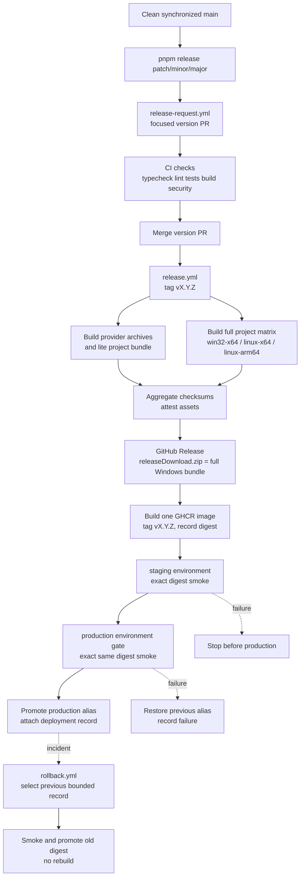

# QQ Guardian deployment and release

This is the canonical deployment runbook. It explains how the preferred
SnowLuma standalone service, the legacy-compatible NapCat plugin, and the
release/deployment automation fit together. The transport contract is defined
in [ARCHITECTURE.md](ARCHITECTURE.md); the longer Chinese operator walkthrough
is [docs/deployment/snowluma.md](docs/deployment/snowluma.md).

## Choose a supported route

SnowLuma is the preferred modern route for new installations. Use the supplied
Docker Compose sidecar on Linux, NAS, WSL2, or Docker Desktop, or use the
native templates for a separately managed Windows/Linux process. NapCat is
fully supported for existing NapCat installations that need Guardian as an
in-process plugin; it is the compatibility route, not a standalone SnowLuma
deployment.

| Route | Artifact | Provider connection | State ownership |
| --- | --- | --- | --- |
| SnowLuma Compose | `qq-guardian-snowluma-vX.Y.Z.zip` or a full project bundle | Forward WebSocket by default; HTTP and reverse WebSocket are explicit alternatives. | SnowLuma and Guardian keep separate named volumes. |
| SnowLuma native | SnowLuma runtime archive plus `deploy/native/` assets | Loopback or an explicitly configured private endpoint. | Guardian data/config directories are outside the replaceable application directory. |
| NapCat plugin | `napcat-plugin-qq-guardian-vX.Y.Z.zip` | NapCat's in-process plugin/OneBot API. | NapCat owns the plugin directory; Guardian state stays in its configured data path. |

Never expose OneBot, noVNC, SnowLuma WebUI, or Guardian WebUI directly to the
public Internet. Use loopback, a private network, VPN, SSH forwarding, or an
authenticated reverse proxy.

## Release assets and the full repository bundle

The release workflow creates two classes of assets:

1. Provider runtime archives contain only the reviewed NapCat or SnowLuma
   runtime output.
2. Project bundles contain source and deployment material. The `full-*`
   archives contain the complete deployable repository payload for a platform,
   including `.github` workflows, tests, `src/`, `scripts/`, `docs/`, `deploy/`,
   both provider outputs, environment examples, and the embedded Node runtime.

`releaseDownload.zip` is a compatibility alias of the Windows x64 full bundle.
It is intentionally a full repository payload, not a standalone `dist/`
folder. It is suitable for an operator or another automation system that needs
the repository's configured deployment assets and verification scripts in one
extractable directory.

The full bundle does not contain Git's `.git` metadata, `node_modules`, local
`.env` files, credentials, databases, logs, source maps, coverage, or generated
release output. Those exclusions keep the artifact reproducible and prevent
local secrets/state from becoming release content. A full bundle is therefore
"repository payload + runtime", not a clone with VCS metadata or operator
secrets.

Every archive has a sidecar `.sha256`; `SHA256SUMS` covers the complete release.
Verify the checksum before extraction and run `pnpm run release:verify` when
assembling or auditing release assets.

## Local Compose deployment

From an extracted full bundle or a source checkout after `pnpm run build`:

```sh
cp deploy/.env.example deploy/.env
# Edit deploy/.env: set a unique VNC_PASSWD and the SnowLuma access token.
docker compose --env-file deploy/.env -f deploy/compose.yaml config
docker compose --env-file deploy/.env -f deploy/compose.yaml up -d --build
docker compose --env-file deploy/.env -f deploy/compose.yaml ps
```

The Compose file keeps noVNC, SnowLuma WebUI, and Guardian WebUI published on
host loopback by default. OneBot remains on the private Compose network. Keep
the five named volume identities stable across upgrades; `docker compose down
-v` is a data-destructive operation and must not be used for a normal upgrade.
Follow the first-login, OneBot token, backup, and migration steps in the
[SnowLuma deployment guide](docs/deployment/snowluma.md).

For a source checkout, install and build deterministically with the pinned
package manager:

```sh
corepack pnpm@10.17.1 install --frozen-lockfile
corepack pnpm@10.17.1 run build
```

Released full bundles already contain the built runtimes and embedded Node
where applicable; operators do not install `node_modules` into an extracted
release.

## Provider topology choices

Select one transport with `SNOWLUMA_TRANSPORT`:

| Value | SnowLuma side | Guardian side | Use when |
| --- | --- | --- | --- |
| `forward-websocket` (default) | Enabled `networks.wsServers` entry with `role: Universal`. | Guardian dials `SNOWLUMA_WS_URL`; token is `SNOWLUMA_ACCESS_TOKEN`. | You want the normal bidirectional OneBot session, event stream, and WebSocket heartbeat. |
| `http` | `httpServers` exposes actions and `httpClients` sends events to Guardian's webhook. | Guardian posts actions to `SNOWLUMA_HTTP_URL` and listens on `SNOWLUMA_WEBHOOK_HOST/PORT/PATH`. | A network only permits HTTP. Actions and webhook events work, but there is no bidirectional WebSocket session or frame-level heartbeat/order guarantee. |
| `reverse-websocket` | `wsClients` dials the Guardian listener. | Guardian listens on `SNOWLUMA_REVERSE_WS_HOST/PORT/PATH` and authenticates the bearer token. | The provider must initiate the connection or cannot accept an outbound Guardian connection. |

The configured `path`, `port`, and token must match on both sides. Non-loopback
HTTP or reverse-WebSocket listeners require `SNOWLUMA_ACCESS_TOKEN`. A timed-out
HTTP action is not replayed through another transport because the provider may
already have applied a side effect. See the complete [transport matrix](ARCHITECTURE.md#provider-and-transport-support-matrix).

## CI/CD release and promotion

The workflow follows the same full/lite, platform-matrix shape used by the
[SnowLuma release workflow](https://raw.githubusercontent.com/SnowLuma/SnowLuma/main/.github/workflows/release.yml),
while preserving QQ Guardian's checksums, attestations, and deployment records.



The asset flow is explicit:

| Workflow stage | Immutable output | Consumer |
| --- | --- | --- |
| `release-request.yml` | Focused `release/version-X.Y.Z` PR | Maintainer review and required CI checks. |
| `quality` | Versioned NapCat/SnowLuma runtime archives and lite project archive | GitHub Release aggregation. |
| `full-bundles` | `qq-guardian-vX.Y.Z-full-{platform}.zip/.tar.gz` | Platform-specific operators and `releaseDownload.zip`. |
| `publish` | GitHub Release, `.sha256`, `SHA256SUMS`, provenance attestations | Download and audit. |
| `publish-image` | `ghcr.io/shiyuplay/napcat-plugin-qq-guardian:vX.Y.Z` plus recorded digest | Staging and production promotion. |
| `staging` / `production` | Deployment record containing source SHA, archive checksum, image digest, smoke result, and timestamps | Audit trail and rollback selection. |
| `rollback.yml` | Rollback record and restored/promoted digest | Incident response; it never rebuilds or republishes an image. |

The tag, source commit, archive checksum, image reference, and image digest are
cross-checked before production. Staging and production only move aliases to an
already-built digest; they do not run a second build.

## Requesting and verifying a release

Release maintainers work from a clean, synchronized `main` checkout:

```sh
pnpm release patch --dry-run
pnpm release patch
# or: pnpm release minor / pnpm release major
```

The command validates manifests, synchronizes `origin/main`, rejects an open
version request or existing tag, and dispatches the focused version PR. The
release workflow runs frozen-lockfile installs, typecheck, lint, tests, build,
manifest checks, deterministic archive checks, and provenance before publishing
`vX.Y.Z`.

For a locally assembled release directory:

```sh
pnpm run package:providers:versioned
pnpm run package:project:lite
pnpm run package:project:full
pnpm run release:checksums
pnpm run release:verify
```

Do not publish if verification reports a missing full-repository path, a secret,
an unexpected dependency tree, or a checksum mismatch.

## GitHub environments and immutable rollback

The deployment workflow references protected environments named `staging` and
`production`. Apply the repository's checked-in policy only with an administrator
token, after the workflow branches are merged:

```sh
PRODUCTION_REVIEWER_IDS='[{"type":"User","id":123456}]' \
  GH_TOKEN="$GH_TOKEN" pnpm run environments:apply
GH_TOKEN="$GH_TOKEN" pnpm run environments:verify
```

Replace the reviewer ID with the real, approved GitHub user or team; never
commit a token or reviewer credential. Production must require at least one
reviewer and both environments must enforce the intended protected branch and
status-check policy. The exact REST payload and validation are in
[`config/ci-environments.json`](config/ci-environments.json) and
[`scripts/github-environments.mjs`](scripts/github-environments.mjs).

Main-branch protection is a separate, administrator-only action. After the CI
governance PR is merged and all of its required checks have passed once on
`main`, apply and read back the signed-commit, conversation-resolution,
required-status-check, and explicit single-maintainer pull-request policy:

```sh
GH_TOKEN="$GH_TOKEN" pnpm run governance:apply -- \
  --repo ShiYuPIay/napcat-plugin-qq-guardian \
  --branch main --single-maintainer --confirm-after-main-green
GH_TOKEN="$GH_TOKEN" pnpm run governance:verify -- \
  --repo ShiYuPIay/napcat-plugin-qq-guardian --branch main --single-maintainer
```

`--single-maintainer` is required for this repository because it intentionally
has one maintainer. It keeps pull requests and all eight required CI checks
mandatory, but sets the required approving-review count to zero and disables
last-push approval so the branch cannot deadlock waiting for a second person.
For other repositories, omit the flag to retain the default one-approval and
last-push-approval contract.

Do not run the apply command from a feature branch or before the named checks
exist on `main`; the guard is intentional and prevents a repository-wide merge
deadlock.

After a successful release, **Emergency rollback** in GitHub Actions accepts
`target=previous` (or an explicit retained `vX.Y.Z`) and a bounded
`history_depth`. It selects the previous distinct successful production record,
verifies that its image manifest matches the requested digest, runs the same
image smoke test, and promotes only that digest. A failed promotion attempts to
restore the recorded previous alias. If staging fails, production is not
started; if production fails, the release remains published but the deployment
record is failed and the prior alias is restored where possible. External
user-owned NapCat or SnowLuma hosts are reported as **not executed** and are not
silently changed by this workflow.

## Data, secrets, and upgrades

- Keep `deploy/.env`, OneBot tokens, Guardian credentials, SQLite files, and
  migration backups outside Git and outside release archives.
- Keep application files replaceable and persistent data/config directories
  separate. Back up both before migration or upgrade; unknown provider-specific
  config fields are preserved by the versioned migration path.
- Use the authenticated `/health/verbose` endpoint and `/metrics` for provider
  state, heartbeat age, errors, and correlation IDs. They expose sanitized
  metadata only.
- A full repository bundle contains the deployment scripts and environment
  examples needed to reproduce the same setup, but it does not carry operator
  secrets or runtime dependency trees.

For incident recovery, follow [migration and recovery](docs/architecture/migration.md),
[super-admin recovery](docs/security/super-admin-recovery.md), and the
[immutable promotion notes](docs/operations/immutable-promotion.md).
